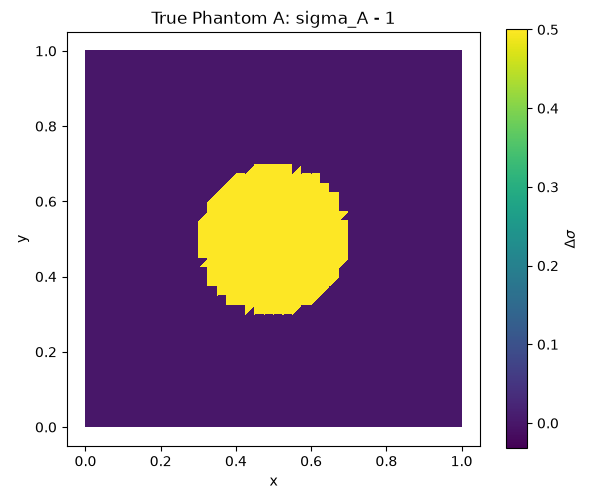
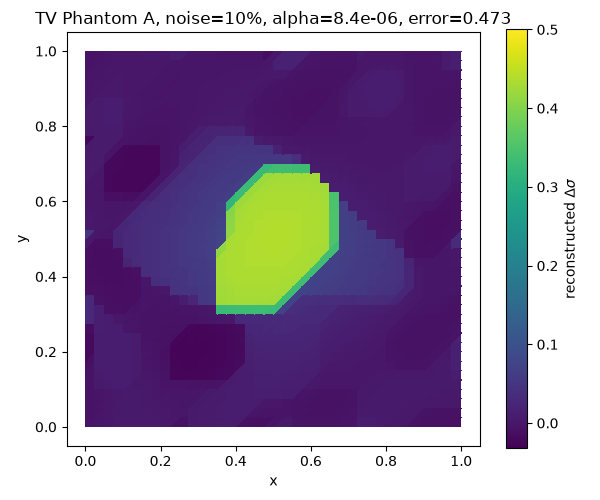
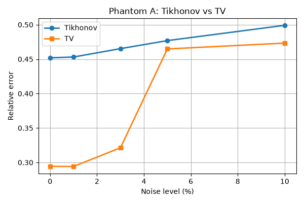
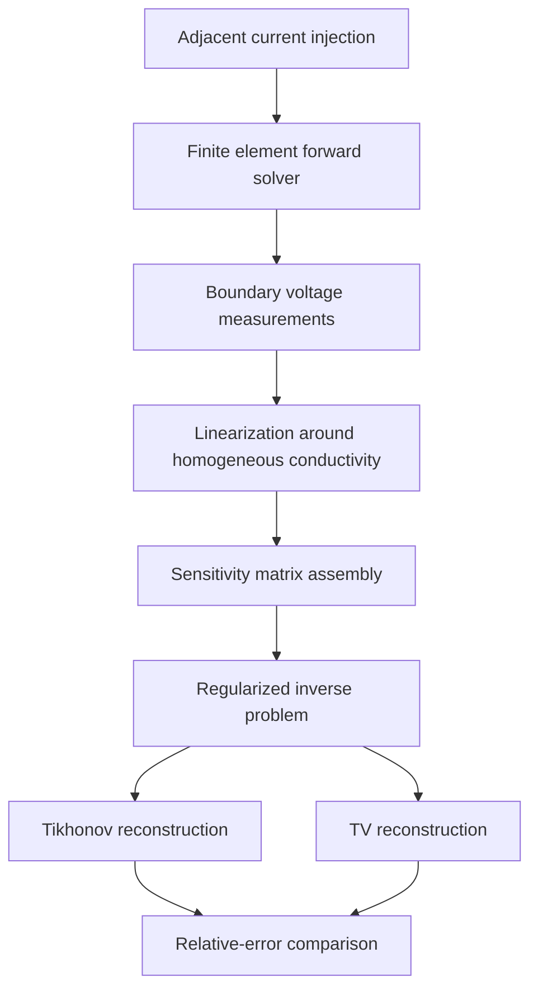
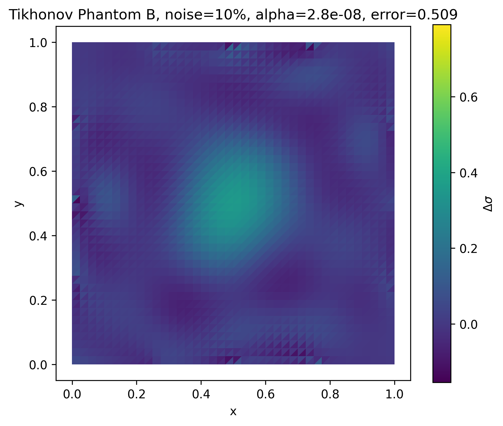
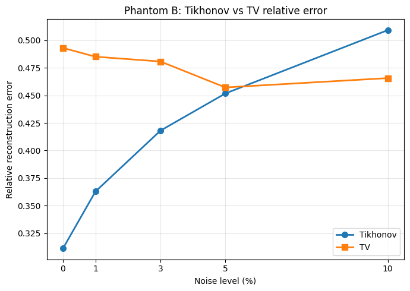

# Noisy Linearized Electrical Impedance Tomography

A numerical study comparing **Tikhonov** and **Total Variation (TV)** regularization for noisy linearized Electrical Impedance Tomography (EIT), using a finite element forward model and controlled synthetic conductivity phantoms.

The project asks a computational inverse-problems question: when boundary voltage data are noisy and the EIT forward map is linearized around a homogeneous background, how strongly does reconstruction quality depend on the match between the regularization prior and the true conductivity structure?

<p align="center">
  
  
  
</p>

<p align="center">
  <sub>Ground truth, representative TV reconstruction, and noise-robustness comparison for the discontinuous inclusion phantom.</sub>
</p>

## Highlights

- Finite element forward solver on a 40 by 40 triangular mesh
- 16-electrode adjacent current-drive protocol
- Linearized EIT inverse reconstruction using sensitivity matrices
- Tikhonov regularization solved through a dual linear system
- Matrix-free primal-dual interior-point TV solver
- Two synthetic conductivity phantoms: discontinuous and smooth
- Five relative noise levels: 0%, 1%, 3%, 5%, and 10%
- Regularization parameter search for each method, phantom, and noise level
- Reconstruction quality evaluated against known synthetic ground truth

## Key Findings

The experiments show that reconstruction quality is controlled not only by measurement noise, but also by the compatibility between the regularization prior and the conductivity structure.

- **Phantom A, discontinuous inclusion:** TV regularization outperforms Tikhonov because it preserves sharp interfaces.
- **Phantom B, smooth Gaussian inclusion:** Tikhonov is more appropriate when the regularization term is active because its smoothness prior better matches the phantom.
- **Noise-free data are not enough:** substantial reconstruction error remains even at 0% noise because of linearization error, discretization error, and regularization bias.

The main scientific conclusion is that prior selection is a structural modelling decision, not merely a numerical tuning choice.

## Mathematical Model

For each adjacent current pattern, the electric potential solves the continuum EIT forward problem

$$\nabla \cdot (\sigma \nabla u^{(k)}) = 0 \quad \text{in } \Omega, \qquad \sigma \frac{\partial u^{(k)}}{\partial n} = g_k \quad \text{on } \partial \Omega.$$

The experiments use a homogeneous reference conductivity and linearize the nonlinear voltage map:

$$F(\sigma_0 + \Delta \sigma) - F(\sigma_0) \approx J \Delta \sigma.$$

After discretizing the conductivity perturbation elementwise, the inverse problem becomes

$$Jz \approx \Delta V^\delta,$$

where the vector contains the unknown triangle-wise conductivity perturbation and the measured data are adjacent electrode voltage differences.

The regularized inverse problem is

$$z_\alpha = \arg\min_z \left\{ \frac{1}{2}\|Jz - \Delta V^\delta\|_2^2 + \alpha R(z) \right\}.$$

This repository compares two choices of prior:

| Method | Regularizer | Expected behaviour |
| --- | --- | --- |
| Tikhonov | $\frac{1}{2}\|z\|_2^2$ | Smooth, stable reconstructions |
| Total Variation | $\|Dz\|_1$ | Edge-preserving, piecewise-constant reconstructions |

## Computational Pipeline



## Implementation

This project implements the full synthetic reconstruction pipeline:

- finite element mesh construction on the unit square
- boundary electrode partitioning and adjacent-drive current injection
- Neumann forward solves with grounding constraint
- electrode-average voltage measurement extraction
- sensitivity matrix assembly from reference-state solutions
- noisy synthetic voltage-difference generation
- Tikhonov reconstruction via a dual linear system
- graph-based TV difference matrix over adjacent triangles
- matrix-free primal-dual interior-point TV reconstruction
- conjugate-gradient Newton solves with diagonal preconditioning
- grid search over regularization parameters
- relative reconstruction error evaluation against known ground truth

## Algorithmic Features

The TV solver is adapted from a Borsic-style primal-dual interior-point method, but specialized to the linearized EIT setting. Compared with a full nonlinear TV-EIT algorithm, this implementation:

- computes the sensitivity matrix once and keeps it fixed throughout reconstruction
- eliminates the dual variables from the coupled Newton system
- solves a reduced symmetric positive-definite Newton system
- uses matrix-free conjugate-gradient iterations instead of forming dense Hessians
- applies diagonal preconditioning and damping for stability
- uses continuation in the TV smoothing parameter to approach the nonsmooth TV penalty

These choices make the project more than a direct application of TV regularization: it is an implementation of a scalable linearized EIT reconstruction workflow.

## Quantitative Summary

| Phantom | Conductivity structure | Better prior | Interpretation |
| --- | --- | --- | --- |
| Phantom A | Piecewise-constant circular inclusion | TV | Preserves the discontinuous interface and reduces smoothing bias |
| Phantom B | Smooth Gaussian inclusion | Tikhonov, when regularization is active | Smoothness prior better matches the conductivity profile |

The results also show that baseline error persists at 0% noise. This indicates that linearization and discretization error can be comparable to, or larger than, measurement noise in linearized EIT.

## Selected Results

### Phantom A: Discontinuous Conductivity

TV regularization recovers the sharp inclusion more faithfully, while Tikhonov produces a smoother, more diffuse reconstruction.


### Phantom B: Smooth Conductivity

Tikhonov regularization better reflects the smooth Gaussian structure when the regularization prior is active. TV can obtain low error in some parameter regimes, but this may occur when the TV penalty has little influence.





## Repository Layout

```text
.
|-- src/
|   |-- eit_phantom_a.py      # Piecewise-constant circular inclusion
|   `-- eit_phantom_b.py      # Smooth Gaussian inclusion
|-- figures/
|   |-- phantom_a/            # Reconstructions and error plots for Phantom A
|   `-- phantom_b/            # Reconstructions and error plots for Phantom B
|-- paper/
|   `-- comparison_of_tikhonov_and_tv_regularization_for_noisy_linearized_eit.pdf
|-- requirements.txt
`-- README.md
```

## Reproducing the Experiments

Create a Python environment and install the dependencies:

```bash
python3 -m venv .venv
source .venv/bin/activate
pip install -r requirements.txt
```

Run Phantom A:

```bash
python src/eit_phantom_a.py
```

Run Phantom B:

```bash
python src/eit_phantom_b.py
```

The scripts perform regularization-parameter searches across all configured noise levels. Synthetic noise is generated with a fixed seed, so the reported reconstruction comparisons are deterministic for the configured mesh, electrode layout, and parameter grids. The Phantom B script saves plots by default; Phantom A can be configured to display or save plots by changing the plotting flags in `src/eit_phantom_a.py`.

## Report

The full written report is available here:

[`paper/comparison_of_tikhonov_and_tv_regularization_for_noisy_linearized_eit.pdf`](paper/comparison_of_tikhonov_and_tv_regularization_for_noisy_linearized_eit.pdf)

## Future Work

Potential extensions include:

- replacing synthetic parameter search with discrepancy-principle or L-curve parameter selection
- testing nonlinear Gauss-Newton EIT reconstruction instead of a fixed linearization
- adding complete-electrode-model contact impedances
- comparing against sparsity, Huber-TV, or learned regularization priors
- studying robustness under electrode modelling error and mesh mismatch
- benchmarking reconstruction time and memory usage for finer meshes

## Notes

- The code is intended as a transparent research prototype rather than a packaged EIT library.
- The phantoms are synthetic, so ground-truth relative errors can be computed directly.
- Regularization parameters are selected using known synthetic truth, which is appropriate for controlled numerical comparison but not available in real experimental EIT.
