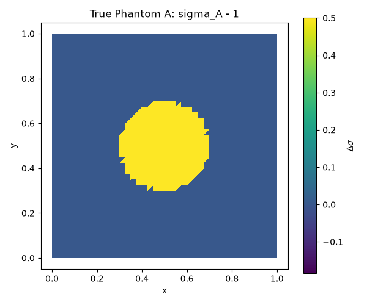
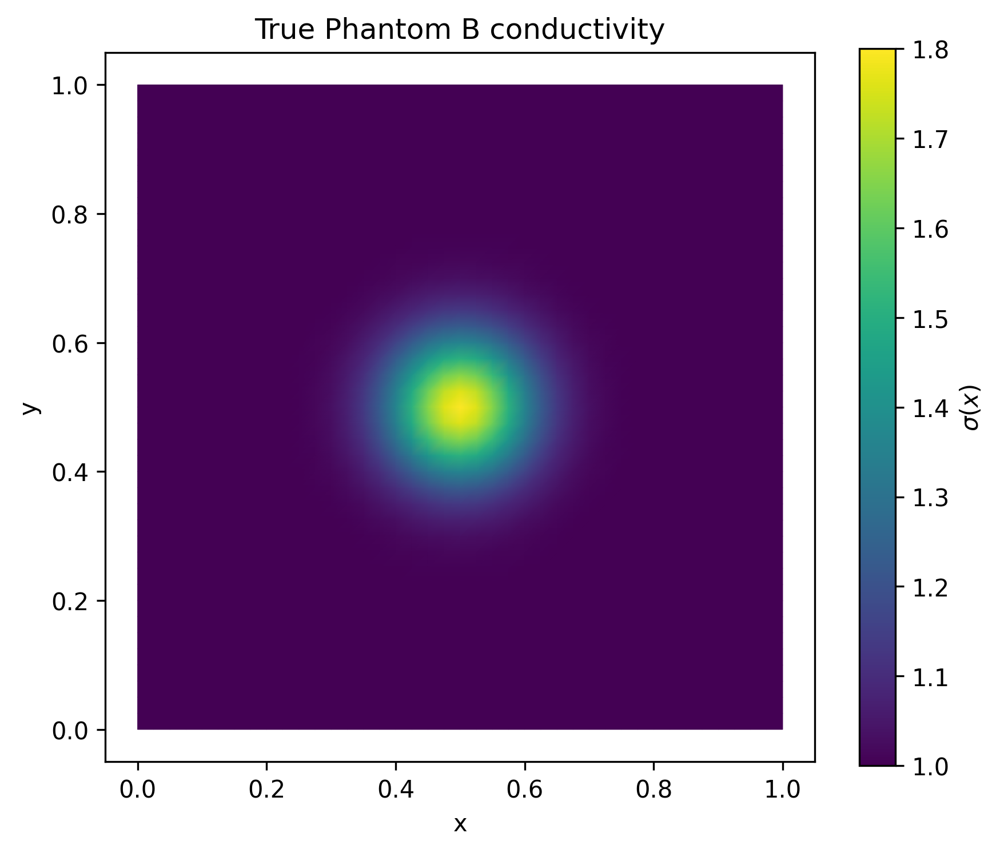
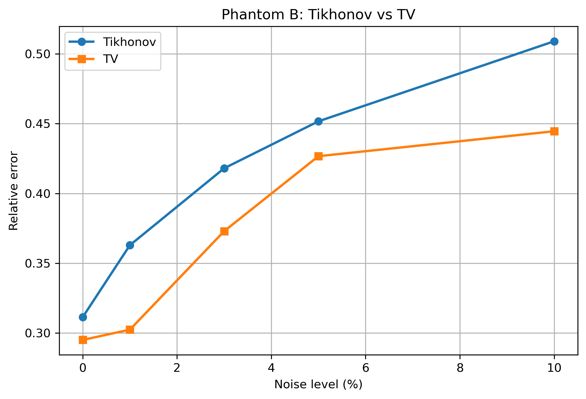

# Noisy Linearized Electrical Impedance Tomography

This repository contains a numerical study comparing Tikhonov and total variation
(TV) regularization for noisy linearized electrical impedance tomography (EIT).
The experiments reconstruct conductivity perturbations on a square domain from
adjacent-electrode voltage measurements.

## Research Context

Electrical impedance tomography is an inverse problem in which internal
conductivity is inferred from boundary current-voltage data. The inverse problem
is ill-posed and sensitive to measurement noise, so regularization is essential.
This project studies two reconstruction strategies:

- **Tikhonov regularization**, solved through a dual formulation.
- **Total variation regularization**, solved with a matrix-free primal-dual
  interior-point method inspired by Borsic-style TV reconstruction.

Two phantoms are included:

- **Phantom A:** a piecewise-constant circular conductivity inclusion.
- **Phantom B:** a smooth Gaussian conductivity inclusion.

Noise levels of 0%, 1%, 3%, 5%, and 10% are tested.

## Repository Layout

```text
.
├── README.md
├── requirements.txt
├── src/
│   ├── eit_phantom_a.py
│   └── eit_phantom_b.py
├── paper/
│   └── comparison_of_tikhonov_and_tv_regularization_for_noisy_linearized_eit.pdf
└── figures/
    ├── phantom_a/
    └── phantom_b/
```

## Methods Summary

The scripts construct a finite element forward model on a 40 by 40 square mesh
with 16 boundary electrodes. Adjacent current injection patterns are used to
generate reference and perturbed voltage data. A linearized sensitivity matrix is
assembled from reference-state solutions, and the inverse problem is solved for
triangle-wise conductivity perturbations.

For each phantom and noise level, the scripts search over regularization
parameters and report the relative reconstruction error against the known
synthetic ground truth.

## Reproducing the Experiments

Create a Python environment and install the dependencies:

```bash
python3 -m venv .venv
source .venv/bin/activate
pip install -r requirements.txt
```

Run Phantom A:

```bash
python src/eit_phantom_a.py
```

Run Phantom B:

```bash
python src/eit_phantom_b.py
```

The Phantom B script is configured to save plots into `phantom_B_plots/` when
run from the repository root. Phantom A currently displays plots interactively
when `SHOW_PLOTS = True`.

## Selected Results

### Phantom A




### Phantom B





## Report

The full project report is available in:

[`paper/comparison_of_tikhonov_and_tv_regularization_for_noisy_linearized_eit.pdf`](paper/comparison_of_tikhonov_and_tv_regularization_for_noisy_linearized_eit.pdf)

## Notes for Research Use

- The code is intended as a transparent research prototype rather than a
  packaged EIT library.
- The phantoms are synthetic, so ground-truth relative errors can be computed.
- The regularization parameter is chosen by grid search against known synthetic
  truth, which is appropriate for controlled numerical comparison but not for
  real experimental data.
- Before publication or thesis submission, add a formal citation entry and
  license statement approved by the project owner.
